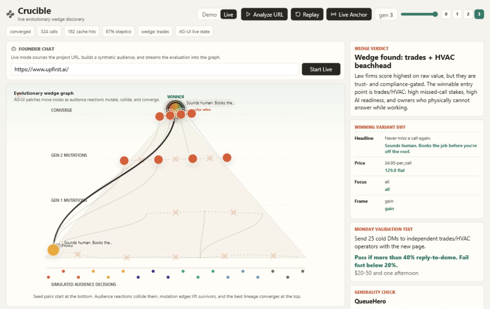

# Crucible

Crucible is a live product-market-fit discovery system. Paste in a project URL and it builds a synthetic audience, tests multiple positioning variants, mutates the winners, and streams the result as an evolutionary graph until a market wedge emerges.

The goal is not to replace real customers. Crucible is a directional hypothesis engine: it helps founders decide who to talk to first, what message to test, and what cheap validation step to run next.



## What It Does

- Starts from a project URL or the included deterministic demo.
- Extracts a product brief and builds audience segments with persona-level objections.
- Scores positioning variants against that audience.
- Mutates and recombines the strongest variants over several generations.
- Shows the process as a live pyramid graph: seed pairs at the bottom, mutations in the middle, and the winning wedge at the top.
- Produces founder-facing outputs: wedge verdict, winning variant diff, Monday validation test, generality check, narration, and audience verdicts.
- Supports demo mode for a reliable replay and live mode for evaluating a new URL.

## Problem Space

New projects rarely fail because teams cannot build. They fail because the team builds for the wrong customer, says the wrong thing, or spreads validation across too many possible markets. Traditional customer research tools tend to answer "what do people think of this idea?" Crucible focuses on the sharper question: "which market segment selects this product, and what positioning helps it win?"

The key distinction is value versus readiness. A segment can have high economic value but low adoption readiness because of trust, compliance, workflow, or switching-cost barriers. Crucible searches for the wedge where urgency, willingness to pay, trust, and adoption readiness overlap.

## Research Behind The Approach

Crucible is inspired by research on synthetic populations, generative agents, and the limits of simulated customer research:

- Silicon sampling: conditioned language models can approximate subgroup response patterns when personas are grounded in detailed backstories rather than thin labels.
- Generative agent simulations: richer narrative grounding and interview-style context produce more stable individual-level behavior than simple demographic tags.
- Known limitation: synthetic panels can collapse toward average, agreeable responses. Crucible counters this with independent reactions, skeptic personas, explicit objections, segment diversity, and a final real-world validation recommendation.

That is why the app avoids claiming certainty. The output is a prioritized hypothesis and a concrete test, not a verdict from an oracle.

## How The Product Works

1. A founder enters a project URL in live mode, or toggles demo mode for the included replay.
2. The backend builds a compact product brief and audience seed.
3. The engine creates candidate positioning variants.
4. Synthetic audience members react independently to each variant.
5. The system aggregates fitness using value, readiness, intent, trust, and objections.
6. Strong variants mutate upward through generations; weak variants fade out.
7. The frontend receives `STATE_SNAPSHOT` and `STATE_DELTA` events and redraws the graph in real time.
8. The final state includes a wedge, a winning message, and a low-cost validation test.

## Why It Is Useful

For a new project, Crucible can quickly narrow the search space before spending weeks on interviews, ads, landing pages, or sales outreach. It is especially useful when a product could plausibly serve many segments and the founder needs a first wedge:

- Which customer segment is most ready now?
- What objection blocks the highest-value market?
- What language moves a skeptical buyer?
- What price or framing should be tested first?
- What is the smallest real-world validation test for Monday?

## Demo And Live Modes

Demo mode uses a deterministic Upfirst replay so the UI and graph are always available without API keys. It is useful for testing, presentations, and offline development.

Live mode accepts a project URL, creates a dynamic audience and variant seed, and runs the same graph/state contract against the new data. Both modes use the same renderer, transport, and convergence UI; only the seed source changes.

## Quickstart

Install the Python and web dependencies:

```powershell
python -m pip install -r requirements.txt
cd web
npm install
cd ..
```

Run tests and create the deterministic replay:

```powershell
python -m pytest -q
python -m engine.run --record
```

Start the API:

```powershell
python -m uvicorn transport.server:app --host 127.0.0.1 --port 8000
```

Start the web app in a second terminal:

```powershell
cd web
npm run dev
```

Open:

```text
http://127.0.0.1:3000
```

## Environment

Copy `.env.example` to `.env` and fill in any keys you want to use. `.env` is ignored by Git.

```dotenv
OPENAI_API_KEY=
WANDB_API_KEY=
REDIS_URL=redis://localhost:6379
FORCE_MOCK=1
LIVE_ISLAND_ONLY=1
PERSONA_MODEL=gpt-4o-mini
ORCHESTRATOR_MODEL=gpt-4o
```

Use `FORCE_MOCK=1` for deterministic/offline behavior. Set `FORCE_MOCK=0` when you want live model-backed behavior. If Redis is unavailable, Crucible falls back to in-memory caching.

## Technology

- Frontend: Next.js App Router, React, TypeScript, lucide-react.
- Live UI contract: AG-UI-style `STATE_SNAPSHOT` and `STATE_DELTA` events over SSE.
- State updates: JSON Patch via `fast-json-patch`.
- Backend: FastAPI, `sse-starlette`, Pydantic.
- Engine: Python simulation pipeline, factor model, audience reactions, mutation, synthesis.
- AI: OpenAI-compatible model calls for live anchors and future persona/orchestrator paths.
- Observability: Weights & Biases Weave tracing when `WANDB_API_KEY` is configured.
- Memory/cache: Redis and RedisVL when `REDIS_URL` is available, with a memory fallback.
- Tests: pytest for contracts, gate behavior, and factor-model checks.

## Project Structure

```text
engine/       Python contracts, factor model, simulation, live URL seed, synthesis
transport/    FastAPI bridge and SSE stream
web/          Next.js interface and live graph renderer
data/         Seed data, starting graph, recorded run
docs/         Screenshots and public documentation assets
tests/        Contract, gate, and model tests
```

## Validation Philosophy

Crucible helps you decide where to aim first. The system should be judged by whether it produces a plausible wedge, explains the objection landscape, and gives a specific real-world test that can disconfirm the recommendation quickly.

The best output is not "the AI says this market is correct." The best output is: "this segment looks most ready, this message appears to win, and here is the fastest test to prove or kill it."
